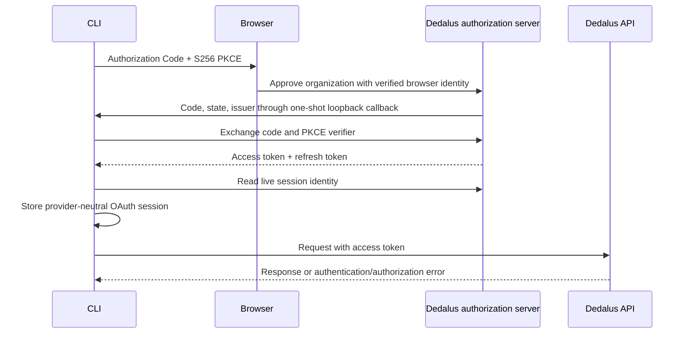
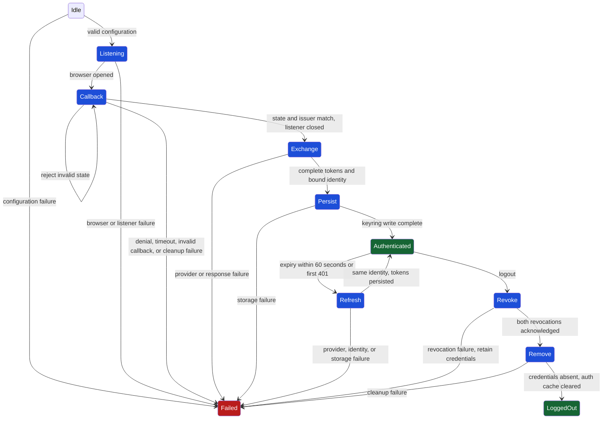

# Command-line authentication

This directory owns the handwritten version 1 command-line interface (CLI)
authentication adapter. Scalar owns the software development kit (SDK) and
resource commands. Generated commands receive one selected credential without
depending on Clerk. Browser login uses OAuth 2.0 Authorization Code with S256
Proof Key for Code Exchange (PKCE). Authenticated commands send the access
token to the configured Dedalus application programming interface (API) gateway.



Dedalus AS is the OAuth 2.0 issuer. `oauth.ts` requests only `offline_access` and
`dedalus:cli`. It verifies callback state, requires an organization-bound
userinfo response, and never embeds a client secret. Code exchange, refresh,
userinfo, and revocation requests do not follow redirects. The optional
website handoff carries the AS authorization uniform resource locator (URL)
in a fragment. OAuth state therefore does not enter website request or
analytics logs. The website reads that fragment in the browser and immediately
asks for explicit organization approval. Clerk supplies browser identity to
the website. Its session token never reaches the CLI.

The command sends the AS access token only to the gateway recorded in its
session. The API checks the live AS token record, current organization
membership, and verified primary email on every request, then enforces access to the requested
resource. Local identity metadata does not grant access.

The CLI stores opaque access and refresh tokens plus identity, organization,
issuer, resource, and gateway metadata. Refresh must return a complete token
pair and the requested scopes. The client refreshes 60 seconds before expiry.
A 401 permits one replay after loading or refreshing a token, with the same
body and idempotency key. API-key requests, 403s, and consumed streams never
take this recovery path.

Credential selection is authoritative and stops at the first priority:

1. `--api-key` or `--x-api-key` workload key
2. `DEDALUS_API_KEY` or `DEDALUS_X_API_KEY` workload key
3. stored OAuth session
4. no credential

Sources never merge or fall back after rejection. Direct `--bearer-auth` and
`DEDALUS_BEARER_AUTH` overrides are rejected because Bearer OAuth tokens enter
only through the stored-session adapter.

The workload `--api-key` flag and stored OAuth session remain distinct during
selection, then use the same generated OpenAPI `BearerAuth` transport. The
adapter injects exactly one value only after it has selected the source.

OAuth credentials require the operating-system keyring. macOS uses Keychain,
Windows uses Credential Manager, and Linux requires a Secret Service keyring.
An unavailable keyring fails the command with an explicit storage error.
A filesystem lock serializes lifecycle changes across CLI processes. The lock
stores no credentials. Operation and lock-release failures are both preserved.
Login refreshes an existing expired session instead of losing its grant.
If a new token pair cannot be stored, the CLI revokes it before reporting the
storage failure. A concurrent revocation failure is reported as well.

The adapter exposes these explicit ownership boundaries:

| Boundary | Classification | Owner and guarantee |
| --- | --- | --- |
| `AuthProvider` | Provider adapter | AS implements login, refresh, and revocation without leaking into generated commands. |
| `CredentialStore` | Authoritative local persistence | The CLI protects and serializes the provider-neutral OAuth session. |
| `resolveCredential` | Authoritative local selection | The CLI selects exactly one workload or OAuth credential by the precedence above. |
| `login`, `status`, `logout`, `accessTokenForCommand` | Authoritative local lifecycle | The CLI locks refresh and persistence before returning a usable token. |
| `addDedalusCommands` | Generated-code integration | Handwritten code injects one selected credential into Scalar-owned commands. |
| Browser sign-in page | Neighboring surface | The website authenticates the user and obtains explicit organization approval. |
| Dedalus API | Server authorization | The API validates credentials and enforces resource access. |

Commands:

```sh
dedalus auth login
dedalus auth status
dedalus auth status --offline
dedalus auth logout
```

`--offline` reads local metadata only. Logout requires provider revocation,
then deletes local credentials and verifies their absence. Revocation failures
preserve credentials for another logout attempt. Read, deletion, and verification
failures fail the command. Completed logout clears the cached refresh failure.
Every auth command accepts `--json`
and excludes access tokens, refresh tokens, authorization codes, PKCE values,
state, and API-key plaintext.

## Configuration

Public defaults, help, and examples use production. `configuration.ts` contains
the public endpoint bundle. Alternate deployment configuration is supplied
privately in a complete owner-private JSON file. No alternate hosts are shipped
in the package. Server-side employee authorization remains mandatory.

For OAuth sessions, `--base-url` and `DEDALUS_BASE_URL` must match the stored
gateway. Changing configuration cannot retarget an existing token. Restore the
original configuration to revoke that session before selecting another one.
Unrelated downloads, configuration files, and browser sessions survive logout.

## Lifecycle

The transition contract is [dfa.ts](./dfa.ts). Every cleanup failure is terminal.



Run `npm run typecheck` and `npm test`. A real browser-to-gateway test remains a
deployment check because it requires the configured AS client, the
deployed Admin API gateway, and a regenerated Scalar resource-command surface.

References: [OAuth token revocation](https://www.rfc-editor.org/rfc/rfc7009),
[RFC 7636](https://www.rfc-editor.org/rfc/rfc7636), and
[RFC 8252](https://www.rfc-editor.org/rfc/rfc8252).
