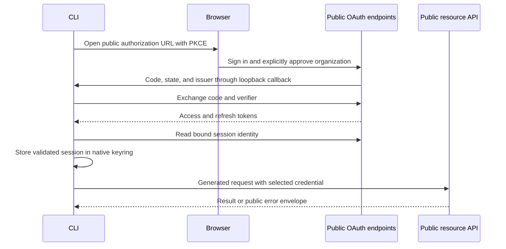
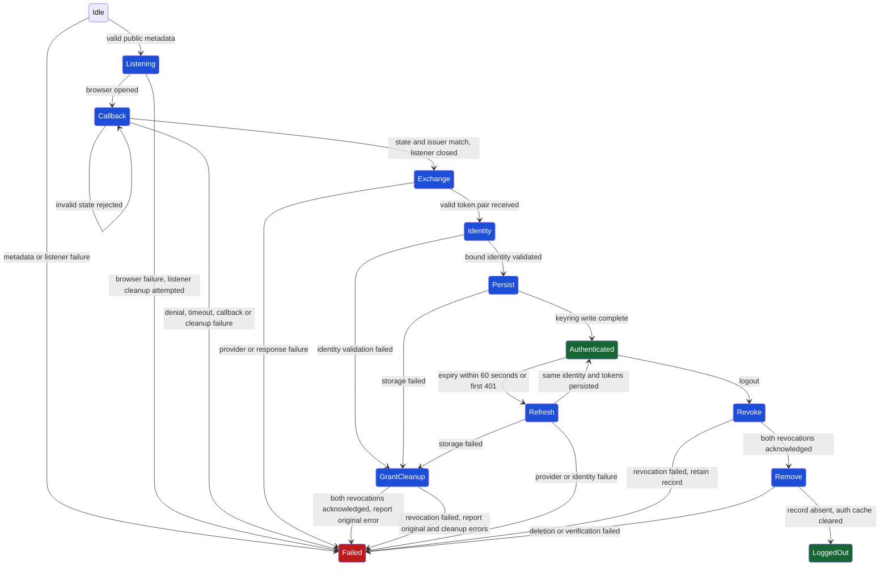

# Command-line authentication

The authentication adapter selects one credential for the generated command-line
interface (CLI). Browser login uses OAuth 2.0 Authorization Code with S256 Proof
Key for Code Exchange (PKCE), which binds the returned code to the CLI that
started login. Resource requests use the public API server and routes declared
by OpenAPI, whether the credential is an API key or a stored session.



## Public protocol

The generated [metadata](./oauth/metadata.generated.ts) contains only approved
public endpoints, the client ID, resource, and scopes. Its source is the public
OpenAPI `cliOAuth` security scheme. The issuer is the authorization service's public
identity. It shares the `https://dcs.dedaluslabs.ai` origin with the resource API.
Regenerate the metadata from the same OpenAPI document used for the SDK:

```sh
node --import tsx scripts/generate-auth.ts openapi.json src/auth/oauth/metadata.generated.ts
```

The authorization endpoint directs the browser to website sign-in and explicit
organization consent. The website receives the authorization URL in a fragment
and removes it before navigation. The CLI receives only the OAuth callback,
never the browser's session credential.

The CLI is a public OAuth client and carries no client secret. The callback must
match the state and public issuer. Code exchange begins only
after the callback response and listener are closed. Exchange, refresh, user-info,
and revocation requests do not follow redirects. User-info must match the issuer,
client, resource, requested scopes, and unexpired session identity.

After receiving a valid token pair, login owns that grant until it returns a
usable session. Identity-validation failure attempts both token revocations
before returning the original error. A simultaneous cleanup failure is preserved
alongside it. Failed durable writes follow the same revocation rule.

The server verifies the live credential, organization membership, and resource
access. Local identity metadata does not grant permission. The CLI treats tokens
as opaque values and does not parse their claims.

## Credential ownership

Selection stops at the first available priority:

1. `--api-key` or `--x-api-key`
2. `DEDALUS_API_KEY` or `DEDALUS_X_API_KEY`
3. A stored OAuth session
4. No credential

Multiple credentials at one priority are rejected. A rejected source never
switches to a lower-priority source. Direct `--bearer-auth` and
`DEDALUS_BEARER_AUTH` overrides are reserved for the stored-session adapter.
Credential-bearing custom headers are rejected.

Workload API keys and OAuth access tokens use the generated Bearer transport.
An explicit X-API-Key credential uses that header. Authentication never rewrites
the generated API URL or adds a path prefix. Stored sessions require
`--base-url` or `DEDALUS_BASE_URL` to match their configured public resource origin.

| Boundary | Ownership |
| --- | --- |
| `AuthMetadata` | Validated public protocol fields generated from OpenAPI. |
| `AuthProvider` | Login, refresh, and revocation bound to those public fields. |
| `CredentialStore` | Native session persistence and cross-process lifecycle locking. |
| `resolveCredential` | Selection of one workload or OAuth credential. |
| `login`, `status`, `logout` | Session lifecycle and safe result metadata. |
| `addDedalusCommands` | Credential injection into generated commands. |
| `AuthenticatedCommandClient` | One OAuth recovery attempt around the SDK's HTTP implementation. |

## Native storage

The CLI requires the operating system's keyring: Keychain on macOS, Credential
Manager on Windows, or Secret Service on Linux. An unavailable keyring returns
an explicit storage error. A filesystem lock serializes lifecycle changes across
processes and contains no credentials. Operation and lock-release failures are
both preserved.

Session version 2 stores tokens, expiry, issuer, client, resource, user,
organization, and granted scopes. Its native entry uses service
`com.dedalus.cli` and account `session-v2`. The CLI does not read the pre-release
account or retarget its tokens. The server cutover rejects pre-release grants
that lack the public issuer binding. A fresh login creates the v2 entry.

A malformed v2 record fails closed. Remove only that native entry through the
system credential manager, then run `dedalus auth login`. Manual local removal
does not confirm remote token revocation.

## Lifecycle

```sh
dedalus auth login
dedalus auth status
dedalus auth status --offline
dedalus auth logout
```

Login retains an existing usable session or refreshes an expired one. Resource
commands refresh within 60 seconds of expiry. An unexpected HTTP 401 allows one
replay after loading a newer stored token or refreshing under the lifecycle lock.
The replay uses the same body and idempotency key, the identifier that makes a
repeated mutation safe. API keys, HTTP 403 responses, and consumed streams do not
enter OAuth recovery. WebSocket reconnection is outside this HTTP recovery path.

Temporary refresh failures retain credentials for a later attempt. Permanent
provider failures are cached for the affected credential within the process.
The CLI cannot guarantee recovery when a rotated refresh-token response is lost
before it can be saved.

Offline status reads local metadata without provider calls. Logout revokes both
tokens, removes the native record, then verifies its absence. Revocation failure
retains the record for another attempt. Completed logout clears the cached
refresh failure. Unrelated downloads, files, and browser sessions remain intact.

Every auth command accepts `--json`. Output omits tokens, codes, PKCE values,
state, and API-key plaintext. Local failures use stable CLI error codes and safe
messages. Public API errors retain the server's code, message, and retryability.
Combined failures expose sanitized causes.

The transition contract is [dfa.ts](./dfa.ts). Grant cleanup reports failure
even when revocation succeeds, because the operation that required cleanup failed.



## Verification

Run `pnpm run typecheck`, `pnpm test`, and
`CLI_NATIVE_KEYRING_TEST=1 pnpm run test:native`. The native test requires a
working keyring and uses a separate temporary entry. Ownership, style,
public-surface, and package checks are documented in the root README.

Hosted login, authenticated requests, refresh, and logout require a compatible
server deployment. Local checks do not establish that deployment or remove
historical public copies.

References: [OAuth token revocation](https://www.rfc-editor.org/rfc/rfc7009),
[PKCE](https://www.rfc-editor.org/rfc/rfc7636),
[native applications](https://www.rfc-editor.org/rfc/rfc8252), and
[issuer identification](https://www.rfc-editor.org/rfc/rfc9207).
