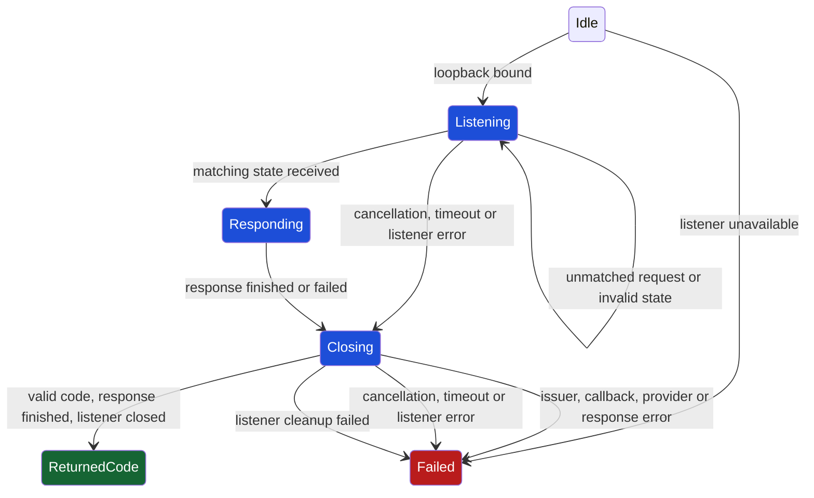

# Authentication foundations

The session validators accept public OAuth endpoint metadata and one
organization-bound token pair. They reject malformed or cross-origin values
before those values can enter storage or provider operations.

```text
Untrusted metadata/session -> schema validation -> typed auth values
```

| Module | Contract |
| --- | --- |
| `schema.ts` | Validated public origins, opaque tokens, identity and native-record shape. |
| `types.ts` | Provider operations and safe session metadata. |
| `errors.ts` | Distinct local, network and provider failures. |
| `dfa.ts` | Allowed observations for the authentication lifecycle. |
| `credential-contract.ts` | Decode one bounded native record into a validated session. |
| `credentials.ts` | Select one credential and provide native storage with a lifecycle lock. |
| `workflow.ts` | Serialize login, status, refresh and logout against one stored identity. |
| `oauth/metadata.generated.ts` | Approved public issuer, endpoints, client and requested scopes. |
| `oauth/http.ts` | Bounded token and user-info requests with validated response fields. |
| `oauth/payload.ts` | Token fields, exact scopes and user identity binding. |
| `oauth/response.ts` | Bounded UTF-8 JSON reads with preserved stream cleanup failures. |
| `oauth/callback.ts` | One-use state- and issuer-bound callback on IPv4 loopback. |
| `oauth/loopback.ts` | Listener lifetime and constant-time state comparison. |
| `oauth/page.ts` | Local completion page that excludes grant values. |

Workload flags take priority over workload environment variables, then the
stored session. Credentials at the same priority cannot be combined.
Credential-bearing custom headers are rejected.

Native sessions use Keychain, Credential Manager, or Secret Service. A missing
entry differs from an unreadable entry. The lifecycle lock preserves both an
operation failure and any lock-release failure.

Login keeps a usable stored grant and refreshes an expiring grant under the
lifecycle lock. A provider result becomes usable after its native write succeeds.
A failed write revokes the new grant. Refresh cannot change the user, organization,
issuer, client or resource. The caller supplies the provider implementation.

Offline status reads stored identity without provider calls. Logout requires
provider revocation before removing the native entry, then verifies local absence.
A failed revocation retains the entry for another attempt.

Run `pnpm run build`, `pnpm run typecheck`, and
`node --import tsx --test tests/auth/*.test.ts`.
Run `CLI_NATIVE_KEYRING_TEST=1 pnpm run test:native` with an available native
credential store. It creates and removes a separate disposable entry.

Regenerate public OAuth metadata from the same published OpenAPI document as the SDK:

```sh
node --import tsx scripts/generate-auth.ts openapi.json src/auth/oauth/metadata.generated.ts
```

The generator accepts only the approved public API origin and emits only its
validated authentication fields. Unrelated source fields are excluded.

OAuth HTTP requests use only the configured endpoints, reject redirects and
validate token, scope, expiry and identity fields before returning a value.
Responses are bounded to 512 KiB. A failed read retains any simultaneous cleanup failure.

## Callback lifetime

A callback returns its code after the browser response finishes and the listener
closes. Invalid state leaves the attempt available for its matching response.
Cancellation and timeout close the listener before returning failure.
The full transition contract is [dfa.ts](./dfa.ts).


